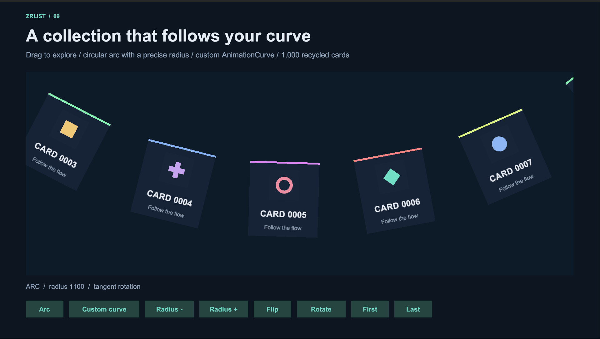
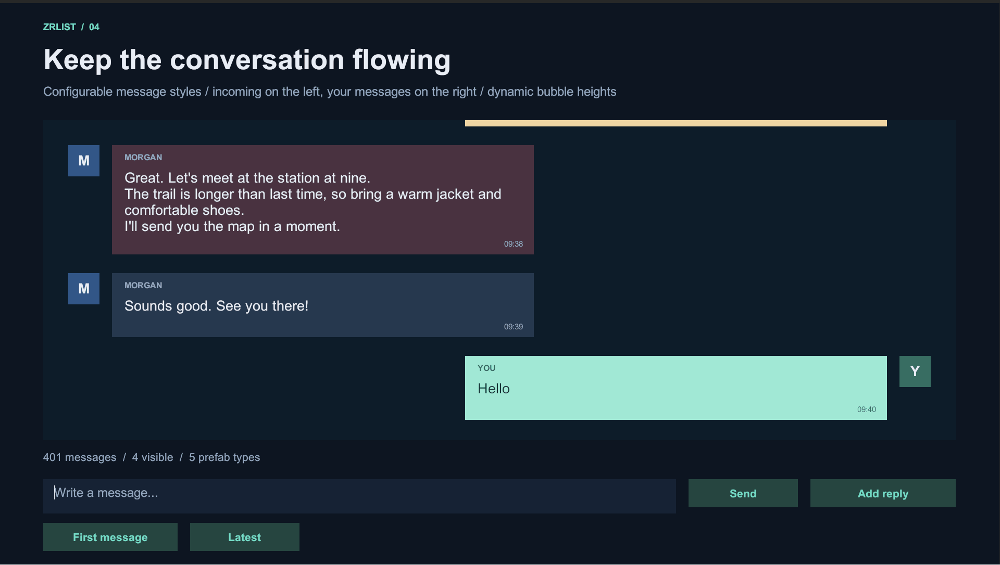
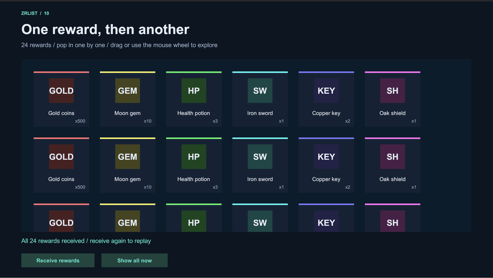

# ZRList

English | [简体中文](README.md)

Virtualized lists and grids for Unity uGUI. Create and reuse views for visible items, with horizontal and vertical scrolling, dynamic item sizes, multiple prefabs, nested scrolling, and animated navigation.

- Unity **2021.3 LTS or later**, including Unity 6.
- UPM package: `com.zr.list`, version **1.0.1**.
- The runtime depends only on `com.unity.ugui`.
- License: [Apache-2.0](LICENSE.md).

## Demos

### Curved scrolling

Explore 1,000 recycled cards along a circular arc or a custom curve, with optional tangent rotation.



### Chat with dynamic heights

Multiple message prefabs, wrapped text measurement, outgoing messages, and replies.



### Reward reveal

Rewards appear one at a time, with replay and skip controls. In this `DirectRewardReveal` demo, cells sit directly under Content without row objects.



## Installation

In Unity, open **Window → Package Manager → + → Add package from git URL**, then enter:

```text
https://github.com/zhanglinshuia-code/ZRList.git?path=/Packages/com.zr.list#main
```

This tracks the `main` branch. To pin a release instead, use a version tag:

```text
https://github.com/zhanglinshuia-code/ZRList.git?path=/Packages/com.zr.list#v1.0.1
```

You can also download the repository and use **Add package from disk** to select `Packages/com.zr.list/package.json`.

After installation, expand the package's **Samples**, import **ZRList Demos**, and open a scene from the imported `Scenes` folder. The repository distributes a UPM package; Unity imports the demos into your project.

## Updating

- **Installed from `#main`:** select **ZRList** in Package Manager and use **Update** when available. Otherwise, add the same Git URL again to resolve the branch's current commit. New commits are not installed automatically.
- **Installed from a version tag:** add the Git URL with the new tag to upgrade, or switch to `#main`. Updating a pinned tag does not select a newer release tag automatically.
- **Demo scenes:** reimport **ZRList Demos** after upgrading. Previously imported copies under `Assets/Samples` do not update with the package.

Git dependencies record their resolved commit in the project lock file. See [Unity's Git dependency documentation](https://docs.unity3d.com/6000.0/Documentation/Manual/upm-git.html#git-locks) for resolution and update behavior.

## Quick start

1. Add `VirtualScrollRect` and `VirtualScrollView` to your scrolling object.
2. Assign `Content`, `Viewport`, `ScrollRect`, and `ItemPrefabs`. Use the array even for a single prefab.
3. Use a top-left Content pivot `(0, 1)`. Do not add a LayoutGroup or ContentSizeFitter to Content to arrange the item roots.
4. Add `using ZRList;` to your code. Custom assembly definitions reference `ZRList.Runtime`; code that uses uGUI also references `UnityEngine.UI`.

```csharp
scrollView.Initialize(data.Count);
scrollView.OnItemRender += OnItemRender;

void OnItemRender(ScrollItemView item, int dataIndex)
{
    if (item.CachedComponent == null) {
        item.CachedComponent = new ItemView(item.Root);
    }

    ((ItemView)item.CachedComponent).SetData(data[dataIndex]);
}
```

`data` and `ItemView` belong to your application. `ItemView` is a plain C# class: cache component references in its constructor and update the displayed content in `SetData`. Subscribing to the render callback fills the initial viewport. Views are recycled when they leave the viewport, and `CachedComponent` stays with the view instance. Unsubscribe your event handlers when your controller is destroyed.

### Updating content and sizes

```csharp
scrollView.RefreshItem(index);            // Rebind and measure changed content.
scrollView.SetItemSize(index, size);      // Submit a known width or height.
scrollView.AppendItems(count);           // Append after updating your data source.
scrollView.TryGetVisibleItem(index, out ScrollItemView item);
```

Dynamic sizes apply along the scrolling axis: **height for vertical lists, width for horizontal lists**. Prefab layouts can supply the measured size; application code can submit a known size during binding with `SetItemSize`.

After changing text or layout data, call `RefreshItem`. `SetItemSize` updates the current layout rather than storing a permanent override: later binding, refresh, or jump measurement obtains the size again. Keep persistent size values in your data or adapter.

`StretchItems` is off by default, preserving each prefab's cross-axis size. Enable it to fill the available width in a vertical list or height in a horizontal list.

## Sample scenes

| Scene | Demonstrates |
| --- | --- |
| `VerticalList` | 1,000 cards with different heights, animated navigation, and size changes |
| `HorizontalList` | 1,000 cards with different widths and horizontal scrolling |
| `InventoryGrid` | 503 cells directly under Content, automatic column count, and selection |
| `ItemDrag` | Dedicated drag handles, item swapping, and drag cancellation |
| `CurvedScroll` | Circular arcs, custom curves, tangent rotation, and virtualization |
| `RewardReveal` | Sequential reward animations using virtualized rows |
| `DirectRewardReveal` | Sequential reward animations without row objects, plus replay and skip |
| `Chat` | Multiple message prefabs, wrapped text measurement, sending, and replies |
| `VerticalNestedHorizontal` | A vertical list of horizontal lists, virtualized at both levels |
| `HorizontalNestedVertical` | A horizontal list of vertical lists, virtualized at both levels |

Scenes include editable prefabs and saved component references, with dragging, wheel input, inertia, and elastic boundaries. After importing the demos, use **Tools → ZRList** to rebuild scenes and prefabs.

`VirtualGridView` virtualizes rows; the sample `DirectGridView` reuses cells directly. Grids use fixed cell sizes. Variable-height cells and masonry layouts are not supported by these grid implementations.

The curved demo applies visual offsets and rotation to a child of each item while the list manages the item root. It supports curves expressible along the scrolling axis, such as arcs and waves, rather than closed loops or paths that double back. See the [detailed usage guide (Chinese)](Documentation~/Usage.md) for layout boundaries and integration details.

## Unity versions and input systems

The demos' `DemoInputModule` selects an input module based on the host project's **Active Input Handling**:

| Project setting | Demo input module |
| --- | --- |
| Input Manager (Old), or no Input System package | `StandaloneInputModule` |
| Input System Package (New) | `InputSystemUIInputModule` |
| Both, with Input System enabled | `InputSystemUIInputModule` |

Input System is optional; the runtime requires only uGUI. There is no need to change the host project's input settings.

The project's recorded compatibility checks cover all ten demos, including clicking, dragging, wheel input, and chat input focus:

| Unity version | Verified input configurations |
| --- | --- |
| 2021.3.45f1 | Input Manager; Input System 1.11.2 |
| 2022.3.5f1 | Input Manager |
| 6000.3.11f1 | Input Manager; Input System 1.19.0; Both |

Additional checks cover a Unity 6 Windows IL2CPP player with High managed stripping and Input System, and rebuilding the demo scenes in Unity 2021.3.

When upgrading from **1.0.0**, install `main` or `v1.0.1` or later and reimport the demos to receive the input compatibility fixes. For customized older scenes, replace the EventSystem's `StandaloneInputModule` with `DemoInputModule`.

## Package layout

```text
Packages/com.zr.list/
  Runtime/          # Lists, grids, adapters, views, and pooling
  Samples~/Basic/   # Ten importable demos and editor scene builders
  Documentation~/  # Usage guide and demo GIFs
  package.json
  README.md
  README.en.md
  CHANGELOG.md
  LICENSE.md
  NOTICE
```

Samples enter your project's compilation only after import.

## Documentation and feedback

- [Detailed usage guide (Chinese)](Documentation~/Usage.md)
- [Changelog](CHANGELOG.md)
- [Report an issue](https://github.com/zhanglinshuia-code/ZRList/issues)

## License

Copyright 2026 zhanglinshuia-code. Code, documentation, and the package's original geometric demo icons are licensed under [Apache License 2.0](LICENSE.md).

Demo fonts use Unity's built-in resources, and uGUI is resolved through Unity Package Manager. Those resources retain their respective licenses.
